# VMWare中CentOS如何配置固定IP

## 前言

这阵子在整K8s，因为之前不太清楚VMWare如何设置固定IP地址，所以每次VMWare中都是自动获取IP的，这样就造成了每次只要本地机器重启，虚拟机中的网络又变化了，导致K8S服务无法正常的启动。

这里需要特别感谢群里的小伙伴 **@你钉钉响了** **@清欢渡**  手把手的教学，帮助我学习了一波VMware网络知识~，有时间要好好补一补Linux网络知识 ...，言归正传，下面开始给VMware设置固定IP了

## VMware网络模式

我们安装 VMware Workstations后，进行虚拟机的网络配置时，一般有四种网络连接方式

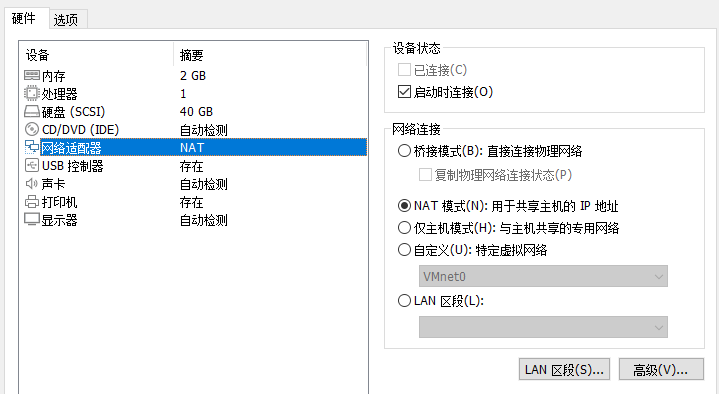

在我们安装好 VMware Workstations后，我们可以打开网络中心会发现生成 两个虚拟网卡，我们打开网络和共享中心能够看到下面的两个


关于这两个网卡对应的规则，我们可以到VMware的虚拟网络编辑器查看

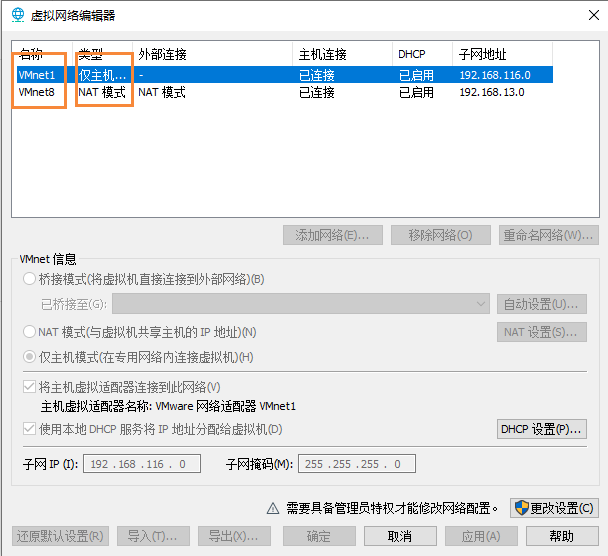

可以发现VMnet1网卡，对应的是 仅主机模式，VMnet8 对应的是NAT模式

### 桥接模式(Bridged)

桥接模式，可以这样进行理解

> 它是通过主机网卡，假设了一条桥，直接连入到网络中了，因此，它使得虚拟机能被分配到一个网络中独立的IP，所有网络功能完全和在网络中的真实机器一样。
>
> 桥接模式下的虚拟机，我们把它认为是真实计算机就行了~


**虚拟机和主机**：可以相互访问，因为虚拟机在真实网络段中有独立IP，主机与虚拟机处于同一网络段中，彼此可以通过各自IP相互访问

**虚拟机与其它主机**：可以相互访问，同样因为虚拟机在真实网络端中有独立IP，虚拟机与所有网络其它主机处于同一个网络段中，彼此可以通过各自IP相互访问

**虚拟机与虚拟机**： 同样可以相互转换，原因同上


桥接模式下，虚拟机就像一台真正的计算机一样，直接连接到实际网络，与宿主机没有任何联系

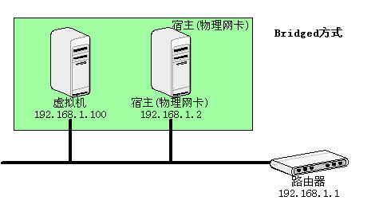

### NAT模式

**NAT**：Network Address Translation，网络地址转换

NAT模式是最简单的实现虚拟机上网的方式

在NAT模式下，宿主计算机相当于一台开启了DHCP功能的路由器，而虚拟机是内网中的一台真实主机，通过路由器(宿主计算机) DHCP动态获得网络参数，因此在NAT模式下，虚拟机可以访问外部网络，反之则不行

使用NAT模式的方便之处在于，我们不需要做任何网络设置，只要宿主机可以连接到外部网络，虚拟机也可以。

**虚拟机与主机**：只能单向访问，虚拟机可以通过网络访问到主机，主机无法通过网络访问到虚拟机

**虚拟机与其它主机**：只能单向访问，虚拟机可以访问到网络中其它主机，其它主机不能通过网络访问到虚拟机

**虚拟机与虚拟机**：VMware NAT模式下，各虚拟机在同一网段下是可以互相访问的

NAT模式下，虚拟机网络连接到宿主机的VMnet8上，此时系统的VMWare NAT Service服务器就充当了路由器的作用，负责将虚拟机发送到VMnet8的包 进行地址转换之后，发到实际的网络上，再将实际网络上返回的包进行地址转换后通过VMnet8发送到虚拟机。VMware DHCP Service 负责为虚拟机提供DHCP服务。

也就是说NAT模式下，虚拟机网卡连接到宿主机的VMnet8的网卡，当VMnet8收到虚拟机发送的数据包时，会吧数据包转发给物理机的网卡。相当于物理网卡不能直接接触虚拟机的数据包，而是接触VMnet8进行处理，实际上VMnet8是NAT模式，自带DHCP功能，能够给虚拟机分配IP地址。

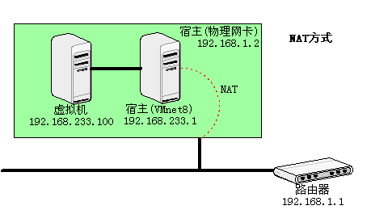

### 主机模式(Host-only Adapter)

主机模式：这是一种比较复杂的模式，需要有比较扎实的网络基础知识才能玩转。可以说前面几种模式所实现的功能，在这个模式下，通过虚拟机及网卡的设置都可以被实现。

我们可以理解为Guest在主机中模拟出一张专供虚拟机使用的网卡，所有的虚拟机都是连接到该网卡上的，我们可以通过设置这张网卡来实现上网以及其他功能


## 为什么使用NAT模式

桥接模式的配置很简单，但是如果网络环境ip资源很缺少，或者对ip管理比较严格的时候，那么桥接模式就不适用了，因为我们通过上面的理解可以知道，桥接模式就是创建一个和宿主机同一级别的网络环境，它是在网络地址中真实存在的ip地址。

如果我们又想让虚拟机上网，又不想占用真实的IP地址，那么就需要使用NAT模式是最好的选择，NAT模式借助虚拟NAT设备和虚拟DHCP服务器，使得虚拟机可以联网。其网络结构如下图所示：

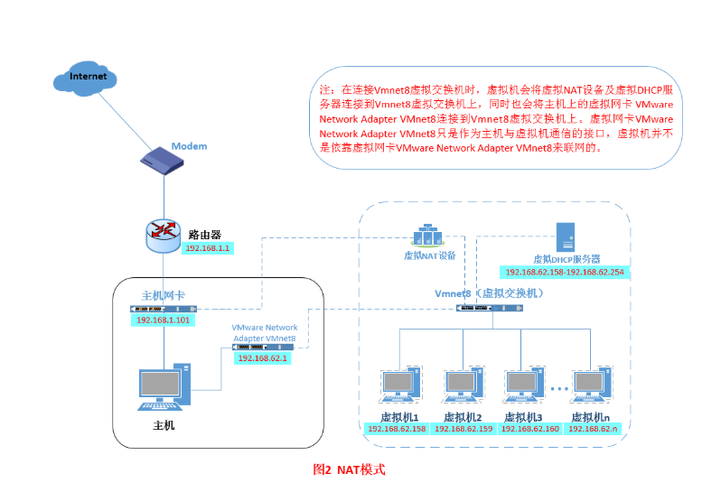

在NAT模式下，主机网卡直接与虚拟NAT设备相连，然后虚拟NAT设备与虚拟DHCP服务器一起连接在虚拟机交换机VMnet8上，这样就实现了虚拟机联网。


## 使用NAT模式配置虚拟机固定IP

### 找到VMnet8网卡

因为NAT模式需要借助宿主机的Vmnet8网卡进行虚拟机与主机之间的通信的，因此我们需要首先找到宿主机上的VMnet8网卡


然后我们右键属性，找到IPv4协议，然后设置一下ip地址

- ip地址：192.168.13.1  【注意这个ip地址，可能和下面重置网络后的不一样，这里可以修改成一致的】
- 子网掩码：255.255.255.0

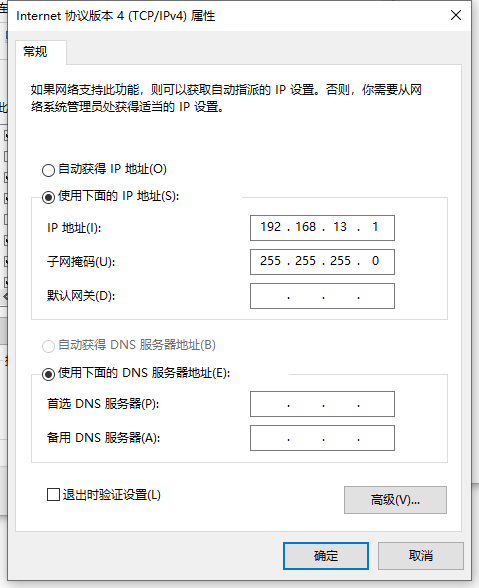

### 虚拟网络编辑器

在设置好VMnet8网卡后，我们到VMware中，点击  编辑 -> 虚拟网络编辑器，然后选择 还原默认值

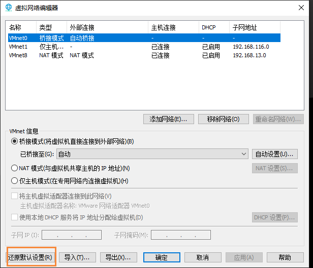

在还原后，我们在上面能够看到有三种模式了，这里我们主要是 操作 NAT模式

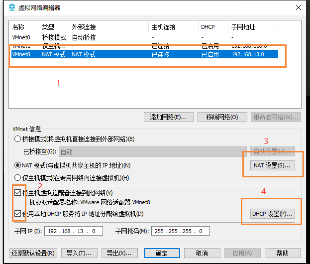

- 首先选择NAT模式
- 然后勾选2中的两个选项
- 第三步就是打开NAT设置

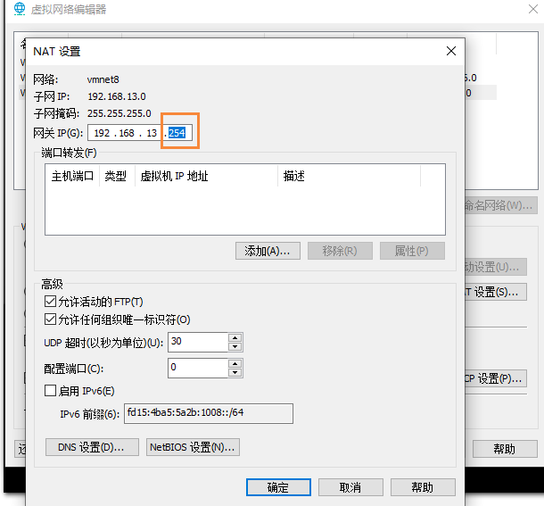

然后设置网关IP为： 192.168.13.254  【这里需要记住这个值，以后会用到】，然后保存

- 第四步点击 DHCP设置

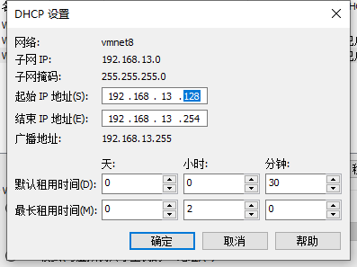

这里能看到我们的起始ip地址 和 结束ip地址，也就是后面我们在设置固定ip地址时，必须在这个范围内

- 设置完成后，回到主页面，点击应用

### 设置CentOS网络连接方式

我们到我们的创建的CentOS系统，右键选择 设置

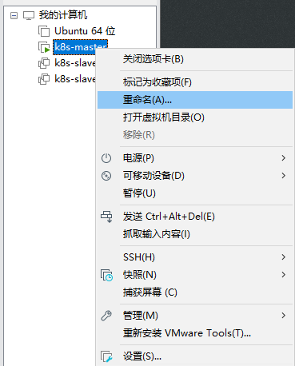

然后找到网络适配器，选择NAT模式，这样我们的系统就通过NAT模式连接了

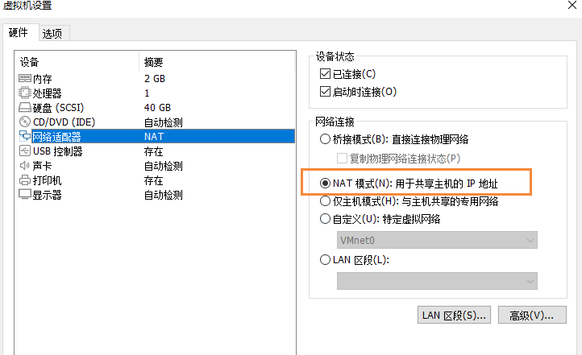


### 设置网络

然后我们就可以启动我们的CentOS系统进行网络配置了

```bash
# 编辑网络配置文件
vim /etc/sysconfig/network-scripts/ifcfg-ens33
```

然后在文件中，加入如下内容

```bash
TYPE="Ethernet"
PROXY_METHOD="none"
BROWSER_ONLY="no"
BOOTPROTO="static"  # 设置静态方式
DEFROUTE="yes"
IPV4_FAILURE_FATAL="no"
IPV6INIT="yes"
IPV6_AUTOCONF="yes"
IPV6_DEFROUTE="yes"
IPV6_FAILURE_FATAL="no"
IPV6_ADDR_GEN_MODE="stable-privacy"
NAME="ens33"
UUID="b4fe4a51-0691-447c-b203-c397cb232eda"
DEVICE="ens33"
ONBOOT="yes"
IPV6_PRIVACY="no"
IPADDR=192.168.13.130 #本机地址
NETMASK=255.255.255.0 #子网掩码
GATEWAY=192.168.13.2 #默认网关
DNS1=8.8.8.8
```

这里需要注意的几个点就是下面几个参数

```bash
# ip地址【DHCP中的范围内的】
IPADDR=192.168.13.130 
# 子网掩码
NETMASK=255.255.255.0
# 网关 【刚刚我们在NAT设置中配置的】
GATEWAY=192.168.13.254
DNS1=8.8.8.8
```

配置完成后，我们就重启网络即可

```bash
#重启网卡
service network restart
```

### 测试

下面我们通过 ping命令，查看是否能够正常访问网络

```bash
ping www.baidu.com
```

发现能够成功访问网络了，这个时候说明我们虚拟机已经能够正常联网~


## 最后

在说一个我遇到的问题，就是在配置好网络后，重启电脑，发现之前配置的虚拟机又不能上网了，后面经过群里小伙伴的指点，发现是重启后，VMware的NAT和DHCP服务已经关闭了，所以我们需要手动启动

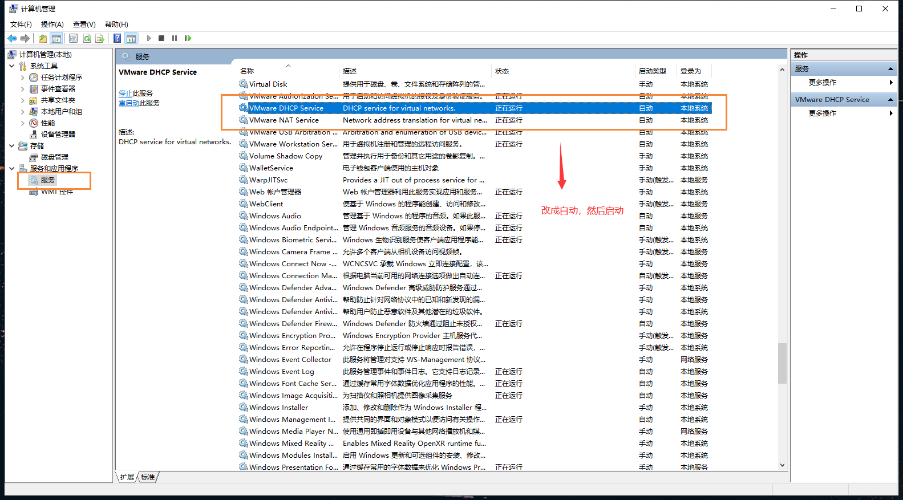

重启后打开虚拟机，发现能够成功联网了~

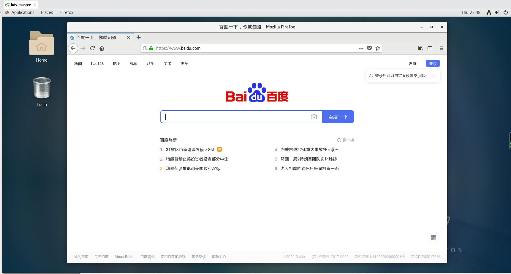

## 参考

https://blog.csdn.net/ning521513/article/details/78441392

https://blog.csdn.net/tyutzhangyukang/article/details/78525086

http://www.moguit.cn/#/info?blogUid=4837a5b04cc34f9f9caee067334baa44